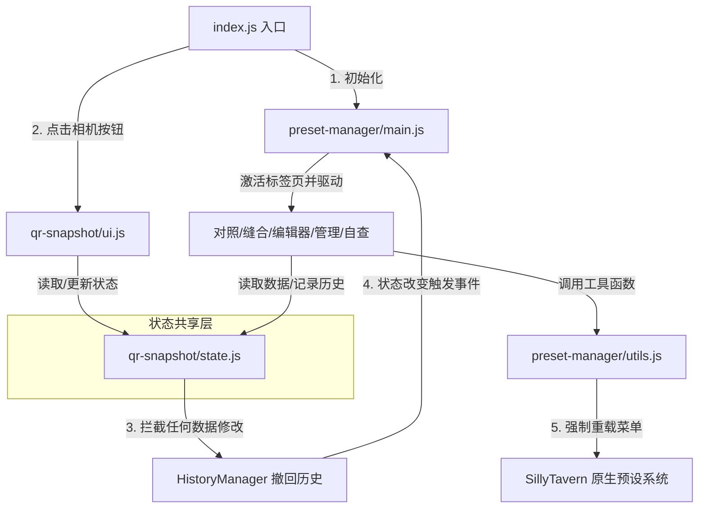

# Zero Preset Manager (SillyTavern 预设管理器扩展)

Zero 是一款针对 SillyTavern 开发的第三方高级预设管理与增强插件。它极大地扩展了 SillyTavern 原生的 Chat Completion (OpenAI/Claude 等) 预设配置能力，提供了诸如 **快照备份、分组隔离、条目差异对照 (Diff)、预设缝合、快捷编辑器及合规自查** 等功能，并内置了完整的 **撤回/还原 (Undo/Redo)** 历史管理器。

---

## 目录与文件架构

整个扩展按照职责高内聚、模块间低耦合的原则，分为根入口、**快照/相机核心 (`qr-snapshot/`)** 和 **高级预设管理器 (`preset-manager/`)** 两大主目录。

```
Zero/
├── index.js                     # 扩展入口文件，负责加载、初始化以及向 SillyTavern 的 QR Bar 注入按钮
├── manifest.json                # 扩展元数据与样式声明文件
│
├── qr-snapshot/                 # 【模块 A：快照与基础状态】
│   ├── state.js                 # 核心状态机（管理快照、分组、隐藏、撤回历史等全局状态）
│   ├── style.css                # 快照管理界面与相机按钮的专属样式
│   └── ui.js                    # 快照管理控制面板 UI (渲染列表、应用/删除快照等)
│
└── preset-manager/              # 【模块 B：高级预设编辑与协同】
    ├── main.js                  # 预设管理器的主控面板（管理 Tabs 路由与基础骨架）
    ├── utils.js                 # 跨模块共享工具库（主题同步、下拉菜单重载等）
    ├── checker.js               # 合规自查模块（Token超限、宏错误提示）
    ├── contrast.js              # 差异对比分析器（两套预设的 Diff 视图与双向覆盖）
    ├── editor.js                # 所见即所得的高级代码编辑器（配合快捷短语）
    ├── stitch.js                # 预设缝合器（跨预设复制、删除、重排条目）
    └── manage.js                # 预设宏观管理（批量 JSON 导入与导出）
```

---

## 核心功能模块详述

### 1. 扩展入口与骨架
* **[index.js](file:///d:/SillyTavern/public/scripts/extensions/third-party/Zero/index.js)**: 
  * 监听 SillyTavern 的 `APP_READY` 和 `CHAT_CHANGED` 事件。
  * 在页面上方的 QR 栏中动态注入代表快照相机的按钮。
  * 预热 OpenAI 接口模块并调用 [preset-manager/main.js](file:///d:/SillyTavern/public/scripts/extensions/third-party/Zero/preset-manager/main.js) 的初始化逻辑。

### 2. 快照核心 (QR Snapshot)
* **[qr-snapshot/state.js](file:///d:/SillyTavern/public/scripts/extensions/third-party/Zero/qr-snapshot/state.js)**: 
  * 管理快照创建、修改与应用流程 (`SnapshotManager`)。
  * 管理条目分组 (`GroupManager`) 和隐藏状态 (`HiddenManager`)。
  * 维护全局的撤回/还原历史栈 (`HistoryManager`)，最大支持 5 步历史回滚。
* **[qr-snapshot/ui.js](file:///d:/SillyTavern/public/scripts/extensions/third-party/Zero/qr-snapshot/ui.js)**: 
  * 渲染快照管理器的浮动主面板（展示快照列表、快照对比、分组控制等）。
  * 触发快照的**一键备份**与**精准还原**。

### 3. 高级预设协同管理 (Preset Manager)
* **[preset-manager/main.js](file:///d:/SillyTavern/public/scripts/extensions/third-party/Zero/preset-manager/main.js)**: 
  * 构建预设管理主弹窗，利用 Tabs 实现对照、缝合、自查和管理四个页面的平滑切换。
  * 处理全局撤回/还原按钮的点击，刷新历史按键的状态。
* **[preset-manager/contrast.js](file:///d:/SillyTavern/public/scripts/extensions/third-party/Zero/preset-manager/contrast.js)**: 
  * 提供两个预设（A 与 B）的多维比对，自动划分“匹配项”、“仅A有”、“仅B有”。
  * 双击条目可打开侧边比对 Diff，支持将条目内容一键复制/同步到对方。
* **[preset-manager/stitch.js](file:///d:/SillyTavern/public/scripts/extensions/third-party/Zero/preset-manager/stitch.js)**: 
  * 允许对当前预设内的 prompt 块进行任意拖拽与复制，或一键“缝合”至其他预设中。
* **[preset-manager/editor.js](file:///d:/SillyTavern/public/scripts/extensions/third-party/Zero/preset-manager/editor.js)**: 
  * 内置沉浸式编辑器，提供深色文本编辑框及常用短语面板，减少手动复制粘贴繁琐度。
* **[preset-manager/checker.js](file:///d:/SillyTavern/public/scripts/extensions/third-party/Zero/preset-manager/checker.js)**: 
  * 读取选定预设的全局数据，检查是否有宏调用格式损坏或 Token 过长的问题。
* **[preset-manager/manage.js](file:///d:/SillyTavern/public/scripts/extensions/third-party/Zero/preset-manager/manage.js)**: 
  * 执行批量的 JSON 配置导入导出，方便与他人共享或迁移预设环境。

---

## 核心功能之间的联动与协同关系

Zero 的高效体验建立在各模块紧密的数据和事件联动机制之上：



### 1. 快照（Snapshot）与预设系统（Preset System）的联动
* 当用户在 [qr-snapshot/ui.js](file:///d:/SillyTavern/public/scripts/extensions/third-party/Zero/qr-snapshot/ui.js) 中点击“应用快照”时，调用 `state.js` 内的 `SnapshotManager.apply()`。
* 该操作会读取快照中的 enabled/disabled 状态，并自动识别当前预设相比快照新增的条目，将这些**新增条目全部置为禁用状态**（避免干扰历史设定的逻辑）。
* 数据被批量推送至 SillyTavern 的原生 openai promptManager，写入并自动执行原生渲染。

### 2. 状态管理器（State）与全局撤回系统（History）的拦截联动
* 在 `state.js` 的 `PresetManager.togglePrompt()`、`GroupManager.create()`、`LinkageManager.add()` 等所有写操作入口，都前置织入了 `HistoryManager.record()`。
* 不管操作发生在快照面板（`qr-snapshot`）还是高级编辑器（`preset-manager`）的缝合、对照、管理面板中，**每一次微小的修改都会被捕获并推入历史还原栈**。
* 恢复状态（Undo/Redo）时，`HistoryManager` 会计算快照与当前后台数据的 Diff，并行执行后端删除或覆盖操作，最后通过原生 API 更新 ST 界面并发送 `zero-history-changed` 事件。

### 3. 工具库（Utils）与 SillyTavern 原生预设同步
* 每当 [preset-manager/manage.js](file:///d:/SillyTavern/public/scripts/extensions/third-party/Zero/preset-manager/manage.js) 导入了新预设或删除了现有预设时，它会调用 `utils.js` 中的 `refreshNativePresetManager()`。
* 该函数会穿透并寻找 SillyTavern 的下拉菜单并强行触发 `change`/`populate` 事件，保证用户在 Zero 面板中修改数据后，**SillyTavern 原生界面不需要手动刷新即可实时同步变化**。

### 4. 对照与缝合（Contrast & Stitch）到快捷编辑器（Editor）的跳转联动
* 在**对照面板**（`contrast.js`）或**缝合面板**（`stitch.js`）中进行深度阅读时，如果用户双击某个 Prompt 项目，或者点击特定编辑图标，系统会立刻异步加载 `editor.js` 的 `openQuickEditor()`。
* 编辑器会以遮罩弹窗形式弹出，并加载该 Prompt 块的实时内容。在编辑器中保存更改后，会同步触发差异检测和自查模块（`checker.js`），自动刷新主界面的高亮提示。
